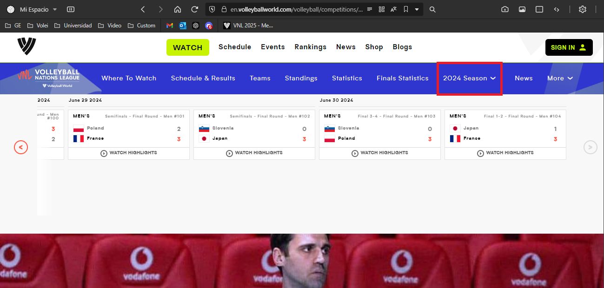

# Estudio del sitio

## Landing Page

No encontré cómo llegar a la información de la Volleyball Nations League (VNL) a partir del landing page de *en.volleyballworld.com*. Sin embargo, al buscar VNL en Google, llegué a la landing page de esta competición en el siguiente enlace: *https://en.volleyballworld.com/volleyball/competitions/volleyball-nations-league/*.

Luego, puede seleccionarse la temporada que se quiere observar, se debe presionar sobre "More" y elegir una de las opciones disponibles.

Al seleccionar una de las temporadas, se te dirige a la landing page de la misma. Se puede observar que la barra superior ha cambiado ligeramente y ahora en ella se observa que estamos en la temporada seleccionada.

